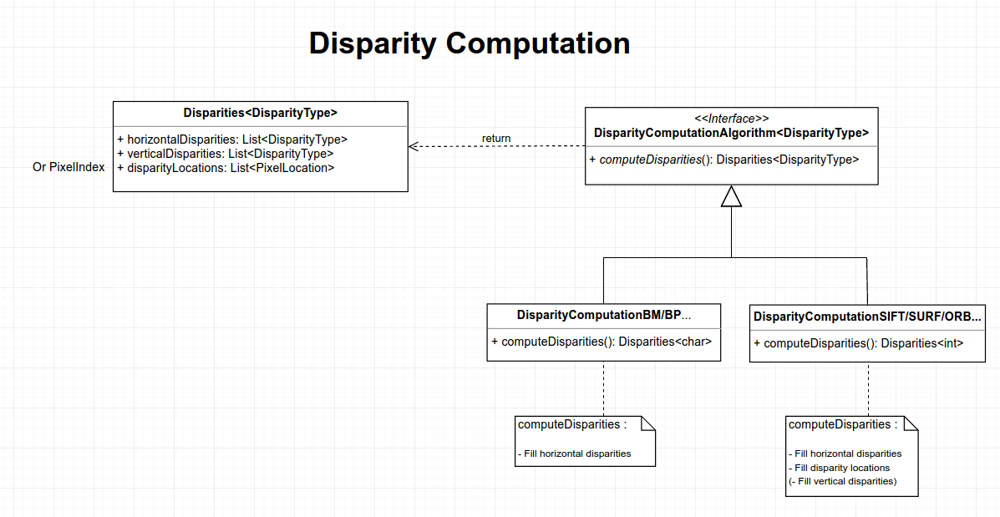

# Disparity Computation

This interface allows the implementation of different strategies to retrieve pixel disparities between two images.

## Interface specification



Implementation can extended by deriving the DisparityComputationAlgorithm interface for a specific disparity type (e.g, uint_8, float). 

A specific implementation of computeDisparities can then be provided and will return a Disparities structure with the specified disparity types. 

An implementation can decide to only fill horizontalDisparities if pixelLocations are trivial and verticalDisparities are 0 (e.g, for a depth map). The horizontal disparities will then be equivalent to a 1D disparity image.

An implementation with feature correspondance could also fill horizontalDisparities and pixelLocations of each disparity since the disparities are sparse in this case and pixel locations need to be provided.

## Example interface implementation

```cpp
#include <vector>
#include <memory>

class Image {};

template <class T>
struct Disparities
{
    std::vector<T> horizontalDisparities;
    std::vector<T> verticalDisparities;
    std::vector<size_t> pixelLocations;
};

template <typename T>
class DisparityAlgorithm
{
public:
    virtual Disparities<T> computeDisparities(Image left, Image right) = 0;
};

class DisparityAlgorithmBM : public DisparityAlgorithm<int>
{
public:
    using value_type = int;
    Disparities<value_type> computeDisparities(Image left, Image right) { return {}; }
};

class DisparityAlgorithmORB : public DisparityAlgorithm<char>
{
public:
    using value_type = char;
    Disparities<value_type> computeDisparities(Image left, Image right) { return {}; }
};


int main()
{
    std::unique_ptr<DisparityAlgorithm<char>> algorithm(new DisparityAlgorithmORB);
    
    Image left, Image right;
    // fill images
    
    Disparities<char> disp = algorithm->computeDisparities(left, right);
    
    auto horiz = disp.horizontalDisparities;
    auto vert = disp.verticalDisparities;    
}
```
